# Organized Life

“Organized Life” is a To-Do List Application offering a straightforward interface where users can manage tasks they want to keep track of. It's designed to help users effectively organize their tasks without any distractions. As a user I want to easily navigate the website and keep track of my to do's.

The website was created for educational purposes only.

[Live page on Github Pages](https://kathrinmzl.github.io/organizedLife/)

- - -

## User Experience (UX)

### Site Goals

- Business Goals: Offer clearly structured to-do list 
- Users’ needs: Easily keep track of tasks and what needs to be done next
- Primary user: Someone looking for an easy to use tool to help organize their life without any distractions

### User Stories
#### Must-have
1. As a user, I want to easily understand the main purpose of the site
2. As a user, I want to be able to easily navigate throughout the site to manage my tasks 
3. As a user, I want to be able to easily understand how the to-do list should be used 
4. As a user, I want to be able to add and delete tasks
5. As a user, I want to be able to easily see which tasks are due next
#### Should-have
6. As a user, I want to keep track of which tasks I already have started working on
7. As a user, I want to keep seeing the tasks I already added when refreshing the page
#### Could-have
8. As a user, I want to be able to edit tasks I already added
9. As a user, I want to be able to filter my to-do list e.g. by task status or deadline

### Features to achieve the goals
- The website will be built with a mobile-first approach, to ensure it is responsive. It will be tested on various devices and screen sizes
- The website will feature a simple introductory text making sure the user directly understands the purpose of the website
- The website will be build in a simple, non-distracting way
- The website will feature a section with instructions on how to use the tool
- The user will be able to add tasks including a task description and a deadline
- The user will be able to delete single tasks but also reset the whole to do list to zero tasks
- Each task can have a status of "open", "in-progress" or "done"
- The tasks will be ordered by their deadline, with the most urgent tasks on top. Tasks that are marked as "done" will always show at the bottom of the page
- All currently shown tasks will be stored to the localStorage and are still available when the page is refreshed
- Each task that is still "open" or "in-progress" can be edited (could-have)
- There will be a filter option which allows the user to filter the shown to-do list out by task status or a certain deadline (could-have)

- - -

## Design

### Wireframes

As the website follows a mobile-first approach, wireframes were created for mobile screens as well as larger screens like tablet and desktop.

Wireframes were created using [Balsamiq](https://balsamiq.com/).

#### Mobile Screens

#### Larger Screens

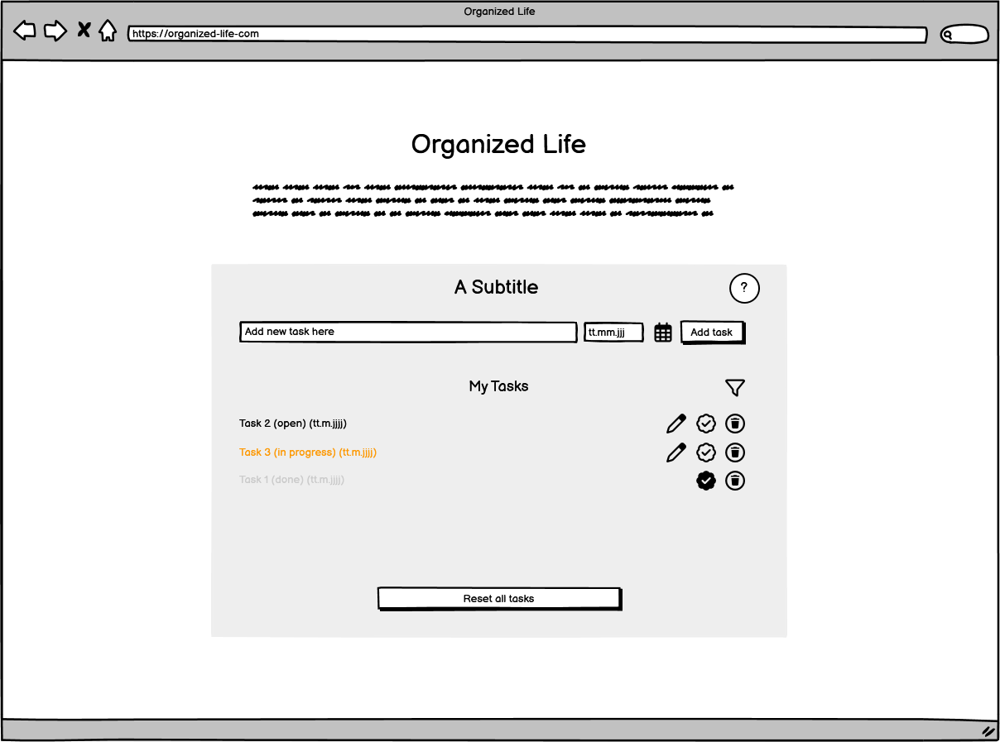

### Colour Scheme

text-color-dark: #081C15

text-color-light: white; 

highlight-color-dark: #081C15

highlight-color: #1B4332

background-color-primary: #D8F3DC

background-color-overdue: #ecdad5

html-background-color-primary: #2D6A4F

html-background-color-secondary: #52B788

The website uses a palette of green colours ranging from white to dark green, which was created by using the [coolors](https://coolors.co/) website. The color green was chosen as a base color for this project because it conveys a sense of clarity, progress, and calm, which are ideal qualities for a focused and motivating to-do list.

Additionally the colors "red" and "darkred" were chosen for the delete/reset icons/buttons and standard "green" for the task completion checkbox.

To differentiate between task statuses another dark red shade (#B10606) and "grey, line-through" were chosen as a text color/decoration for "in-progress" and "done" tasks. This helps the users eye to focus on "in-progress" tasks while blending out "done" tasks. For the same reason a very light shade of red (#ecdad5) was chosen as a background color to identify overdue tasks and helps them stand our even more.

### Typography

Google Fonts was used for the following fonts:

- *Headings: Playwrite US Modern*  
The handwritten aesthetic supports a calm, personal feel, making  the to-do list feel approachable and tailored to individual use.

- *Body: Quicksand*  
This clean, geometric sans-serif font was chosen to ensure high readability and pairs well with the more expressive heading style, creating a balanced and user-friendly interface. 

### Imagery 

The website contains a single image, used as a background for the top heading. It depicts a handwritten to-do list, reinforcing the personal and practical theme of the application. Additional images or animations were intentionally avoided, as they would distract from the core purpose of the site which is providing a focused, minimal environment for task management.

A to-do list icon using a similar colour palette has been chosen as a favicon.

### Features

The website is comprised of one page showing the to-do list and fulfills the must-have and should-have user stories.

Mobile View:

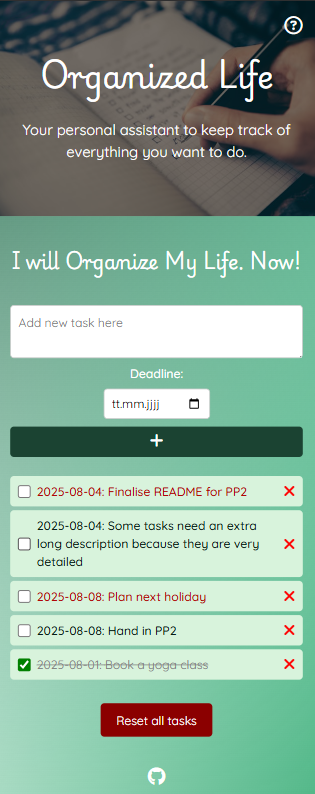

Tablet/Desktop View: 

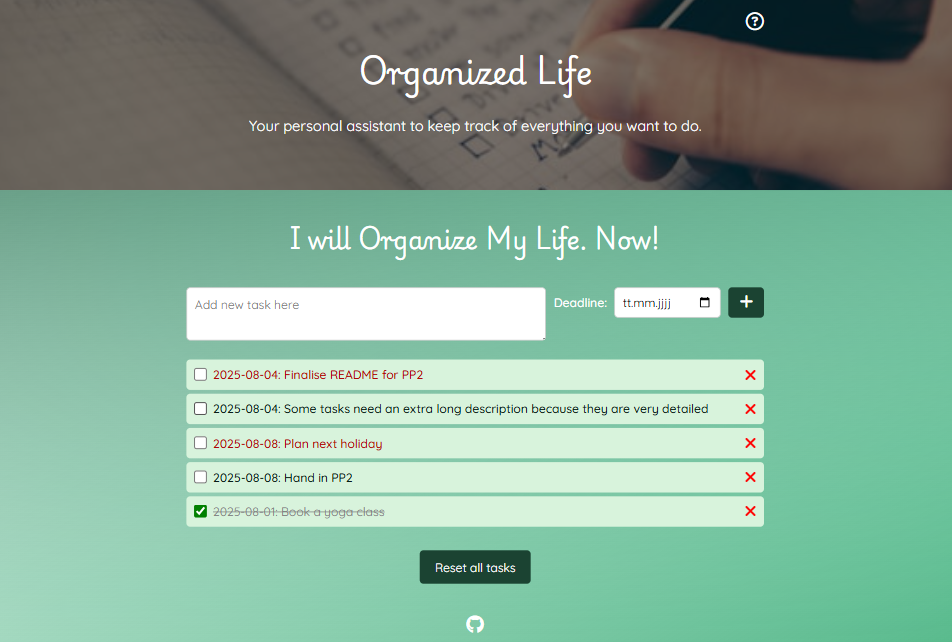

#### Navigation
As the website consists of just one page, there is no navigation bar to switch between sites. The user can only navigate by scrolling up or down the main page. To facilitate the scrolling experience of the user, an "arrow-up" button appears in the bottom-right corner of the main container, once the user scrolls past the top of the task input section. When clicking this button the website scrolls back up to the start of the task input section.

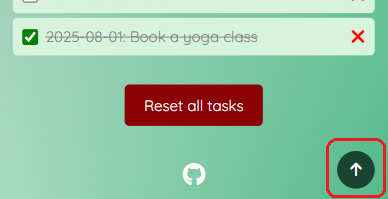

#### Header
The website features a hero image in the header, displaying a handwritten to-do list that reinforces the overall theme. It also includes the website's name as an h1 element and a brief subheading that functions as a catchphrase. 

Additionally the user finds a question mark icon in the top right corner, which opens up an instructions modal, when clicking on it, which provides a brief overview of how to use the to-do list. The icon is placed prominently to ensure that users can access guidance at any time without leaving the page. This supports ease of use, especially for first-time visitors, and contributes to a smooth and self-explanatory user experience.

The header is designed to clearly and quickly communicate the purpose of the site, helping users immediately understand its function without overwhelming visual distractions.

#### Instructions Modal
The instructions modal provides a step-by-step guide on how to use the to-do list, ensuring users can easily navigate its features. It explains the different task status options available, detailing what each status represents and how they affect task management. Additionally, the modal outlines the sorting algorithm used to organize tasks, helping users understand how their list is dynamically ordered for optimal productivity.

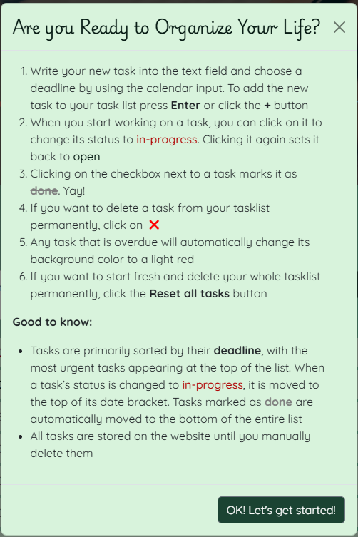

#### Main To-Do List Area
The main to-do list area is divided into two sections: the **task input section** and the **task list section**.

##### Task Input Section  

The task input section allows users to enter a task description and set a deadline. It features an "add" button represented by a "+" sign. Both the task description and deadline fields are required to create a new task entry.

Since task descriptions can often be longer than just a few words, a resizable text area input is used, allowing users to write multiple lines and adjust the input field height accordingly. For the deadline input the minimum allowed date is "today", so that no past dates can be chosen as a deadline.

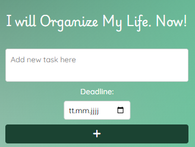

A new task is added to the list only when both the text and date inputs are filled; users can either click the "+" button or press enter to submit. If either field is left empty, an alert message appears prompting the user to complete the missing information, e.g.:

##### Task List Section  
The task list section displays all tasks that have been added to the to-do list. Each task entry includes a checkbox, the task’s deadline, the description, and a red "X" icon for deletion.

Tasks can have one of three statuses: *open*, *in-progress*, or *done*. Newly added tasks are initially set to *open*, indicated by the standard dark text color.

Clicking on the text of an *open* task changes its color to a **dark red** color, marking it as *in-progress*. This color change helps *in-progress* tasks stand out, making it easy for users to identify which tasks they have already started.

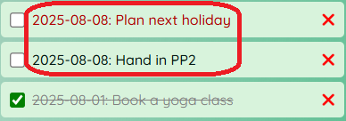

Checking the checkbox marks the task as *done*, displaying the task text in grey with a strikethrough. This styling visually separates completed tasks by pushing them into the background compared to *open* or *in-progress* tasks.

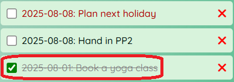

The red "X" icon on the right side deletes the task immediately upon clicking. No confirmation alert is used here to enable quick removal of multiple unnecessary tasks, enhancing ease of use.

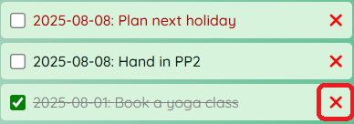

Tasks with a past deadline are automatically highlighted with a light red background to visually emphasize their urgency.

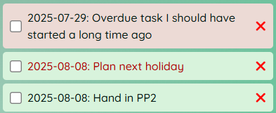

Marking overdue tasks as done, changes their background color back to the standard styling.

At the end of the task list, users will find a **“Reset all tasks”** button. On desktop, it changes to **dark red** when hovered over; on mobile screens, it is styled in dark red by default to clearly indicate that this is a potentially destructive action. When clicked, an alert message appears asking the user to confirm their choice. If confirmed, the entire task list is permanently deleted.

##### Sorting Algorithm  
Tasks are primarily sorted by their **deadline**, with the most urgent tasks (i.e. those with the closest deadline) appearing at the top of the list. Within each date bracket, tasks are initially ordered based on the time they were added, meaning newer tasks appear below older ones.

When a task’s status is changed to *in-progress*, it is moved to the top of its date bracket. This ensures that tasks which have already been started are given higher visibility, helping the user quickly identify which task to finish next.

Tasks marked as *done* are automatically moved to the bottom of the entire list, where they are again sorted by their deadline. If a task is reopened by unchecking its checkbox, its status changes back to *open* and it is reinserted near the top of the list according to its deadline and original position within its date group.

This sorting behavior supports two key goals:  
a) the most urgent tasks are always shown first, and  
b) tasks already in progress are prioritized within their respective deadlines.

#### Local Storage 
All task list items, including their deadlines and current statuses, are stored in the browser’s local storage. This ensures that the task list persists across page reloads and even after closing and reopening the browser, allowing users to continue where they left off without losing their data. By automatically saving changes in the background, this feature significantly improves the usability and practicality of the tool for real-life, everyday use.

Data remains stored until it is manually deleted by the user, the browser cache is cleared, or the local storage is explicitly cleared through the application itself. However, in some cases, such as using private/incognito browsing mode, local storage may be disabled or wiped automatically when the session ends.

**Note**: Local storage is supported in all modern browsers, but may be restricted in certain private browsing modes.

#### Footer
The footer is kept minimal to avoid unnecessary distractions and help users stay focused on the core purpose of the application. It contains only a single icon linking to the project's GitHub repository, as the website is not intended to represent a fictional business or include unrelated social media links, but rather represent a simple online tool.

#### 404 Page
Additionally, I added a 404 page to improve the user experience by clearly informing users when they’ve reached a non-existent page and guiding them back to the main content. A 404 page also ensures design consistency, enhances the project’s professionalism and provides better error handling.

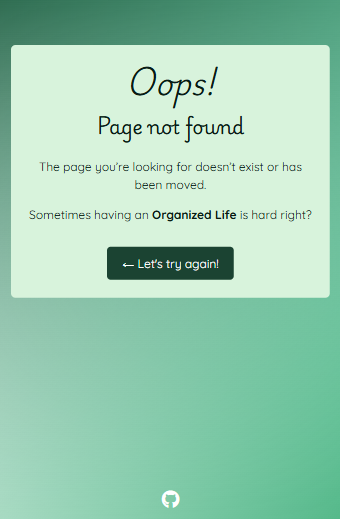

- - -

## Future Features
So far the website includes all necessary features to create a minimum viable product. However, there is room for improvement and further features to enhance usability and task management flexibility:

- *Status and Deadline Filter*   
  A filter icon will allow users to filter tasks by *status* (e.g., open, in-progress, done) and/or *deadline* (e.g., upcoming, overdue), making it easier to focus on specific subsets of tasks.

- *Edit Functionality*   
  A pen icon will be added to each task entry. Clicking the icon will allow users to edit the task description or update the deadline directly within the task list, improving flexibility and reducing the need to delete and recreate tasks.

- - -

## Testing

### Manual Testing

#### Scope

I manually tested all pages of the website throughout the entire build. I utilised Chrome developer tools while building to pinpoint and troubleshoot any issues as I went along. I mainly checked for responsiveness on different screen sizes here.

Early on I deployed the first version of the website to GitHub pages to test it in deployment as well.

Besides Google Chrome, I also tested the deployed website in Microsoft Edge, as this is the only other browser I have installed on my laptop and on my own mobile phone, Google Pixel 7 (Google Chrome).
Friends tested the website additionally in the Safari browser and on an iPhone (Safari).

Besides testing the responsiveness of the website, the following functionalities were also tested for all screen sizes:

Instructions Modal
- Clicking the instructions icon opens the instructions modal
- Clicking outside of the modal or on the button inside the instructions modal closes the modal and makes the user return to the main page

Task Input Section 
- The text input is vertically resizable
- The date input only allows the current or future dates
- The date input can only be filled by using the calendar pop-up
- Clicking the "+" button or pressing Enter, when the text input and date input are filled out, adds a new task to the task list
- If either the text field or the date field or both are not filled out, pressing Enter or the "+" button triggers a corresponding alert message
- Pressing Enter only adds a task if the cursor is inside one of the input fields

Task List Section
- Each task shows in a seperate line and includes a checkbox, the deadline, the task text and a delete icon
- Tasks are primarily sorted by their deadline
- Clicking an "open" task marks it as "in-progress" and moves it to the beginning of its date bracket
- Clicking an "in-progress" task sets its status back to "open"
- Clicking the checkbox marks the task as "done" and moves it to the bottom of the list
- All "done" tasks are as well sorted by their deadline
- Clicking the checkbox of a task marked as "done" opens it up again and moves it back to the top of the list according to its deadline
- Clicking the delete icon for any task, permanently deletes it from the list
- Clicking the "Reset all tasks" button triggers an alert message
- Confirming the "Reset all tasks" alert message deletes all tasks permanently

Scroll Button
- The scroll button appears only if you scroll past the top of the task input section
- Clicking the scroll button scrolls back up to the top of the task input section

Footer
- Clicking the GitHub icon opens the correct link in a new tab

General
- All hover effects work as intended

#### Results
All tests described above completed with the expected result.

### Code Validation

#### JavaScript

[JS Hint](https://jshint.com/) was used to validate the JavaScript code of the website. 

When I tested the first full version of the script I got the following errors/warnings:

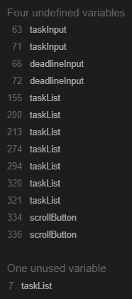
 
I received several warnings from JSHint indicating that certain variables were not defined. 

Initially, these variables were declared inside the `document.addEventListener("DOMContentLoaded", function () { ... })` block, which caused the warnings. To resolve this, I moved the variable declarations to the top of the script, making them global. This ensured they were accessible throughout the entire file and eliminated the warnings. 

Additionally, I added the comment `/* jshint esversion: 11 */` at the beginning of the script to explicitly specify the JavaScript version for validation.

After making these changes and finalizing the script there were no further warnings:

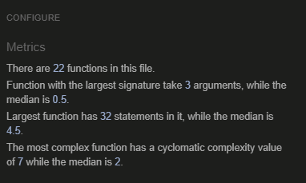

#### HTML

The [W3C validator](https://validator.w3.org/) was used to validate the HTML on all pages of the website. 

##### Main Page

When I tested the first full version of the website I got the following errors/warnings:

- Trailing slash on void elements:  
    This warning comes from using the "Prettier" code formatter in VS Code. I deleted all trailing slashes on void elements

- Possible misuse of `aria-label`:  
    For my instructions modal icon, add button and scroll-up button I initially only used `<i>` elements inside the html file and put aria-labels directly on the icons. This threw the warning.
    To avoid this I wrapped the instructions modal icon and the add icon each inside an `<a>` element and the scroll-up icon inside a `<button>` element, while applying the aria-label directly to the wrapper elements. For the scroll-up icon I needed to chose a `<button>` because otherwise the JavaScript functionality wasn't working correctly anymore

- Section lacks heading:  
    My "task-list-section" initially didnt have a heading for stylistic reasons. To avoid the error I added a heading that is hidden from the page using the `d-none` Bootstrap class

After making these changes and finalizing the script there were no further warnings:

##### 404 Page 

I also validated the 404.html page and got no warnings/error:

#### CSS
The [Jigsaw W3C validator](https://jigsaw.w3.org/css-validator/) was used to validate the style.css file. 

The validator returned no errors for the code:

### Lighthouse

I used Lighthouse within the Chrome Developer Tools to allow me to test the performance, accessibility, best practices and SEO of the website. 

All test categories show good results for both the main page as well as the 404 page.

#### Main Page

Result for desktop screens:

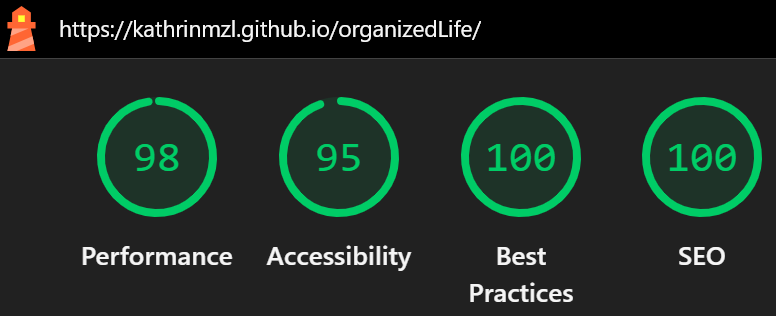

Result for mobile screens:

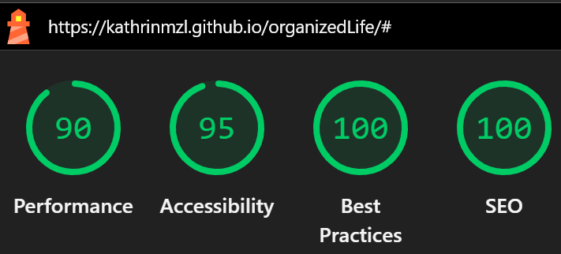

The missing 5% for the "Accessibility Score" on the main page can be attributed to the low contrast between text and background when displaying tasks marked as "done" (see following error message). As it is an intentional feature of the website to display "done" tasks with a lower visibility, I chose not to change the style based on this warning.

#### 404 Page

Result for desktop screens:

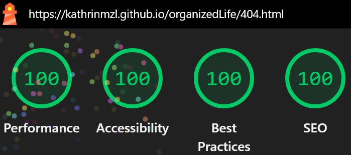

Result for mobile screens:

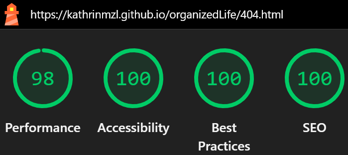

### User Story Testing

| User Story                                                           | Expected Result                                                                                                                                                                                | Pass    |
| -------------------------------------------------------------------- | ---------------------------------------------------------------------------------------------------------------------------------------------------------------------------------------------- | ------- |
| As a user, I want to easily understand the main purpose of the site   | The website will feature a simple introductory text making sure the user directly understands the purpose of the website                                                     | &check; |
| As a user, I want to be able to easily navigate throughout the site to manage my tasks     | The website will be build in a simple, non-distracting way                                                                                                                         | &check; |
| As a user, I want to be able to easily understand how the to-do list should be used | The website will feature a section with instructions on how to use the tool                                                                 | &check; |
| As a user, I want to be able to add and delete tasks                                | The user will be able to add tasks including a task description and a deadline. The user will be able to delete single tasks but also reset the whole to do list to zero tasks | &check; |
|  As a user, I want to be able to easily see which tasks are due next                            | The tasks will be ordered by their deadline, with the most urgent tasks on top. Tasks that are marked as "done" will always show at the bottom of the page                                                                                              | &check; |
|  As a user, I want to keep track of which tasks I already have started working on                            |Each task can have a status of "open", "in-progress" or "done"                                                                                              | &check; |
|  As a user, I want to keep seeing the tasks I already added when refreshing the page                            | All currently shown tasks will be stored to the localStorage and are still available when the page is refreshed                                                                                              | &check; |

### Known Bugs 

#### Missing Placeholder on Date Input Field
When opening the website on a real mobile device, the date input field doesn't display a placeholder preview, making it unclear that it's a date field until the user taps on it. Also, the title attribute is not accessible on most mobile devices, which could help the user.

One possible solution would be to add a visible “Deadline:” label to the date input. However, I haven’t implemented this yet, as it would require adjusting the layout of the task input section to ensure it looks good on both mobile and desktop screens. I plan to address this in a future development stage. In the meantime, the instructions modal provides clear guidance on how to use the app, so users will still understand the purpose of the date input field.

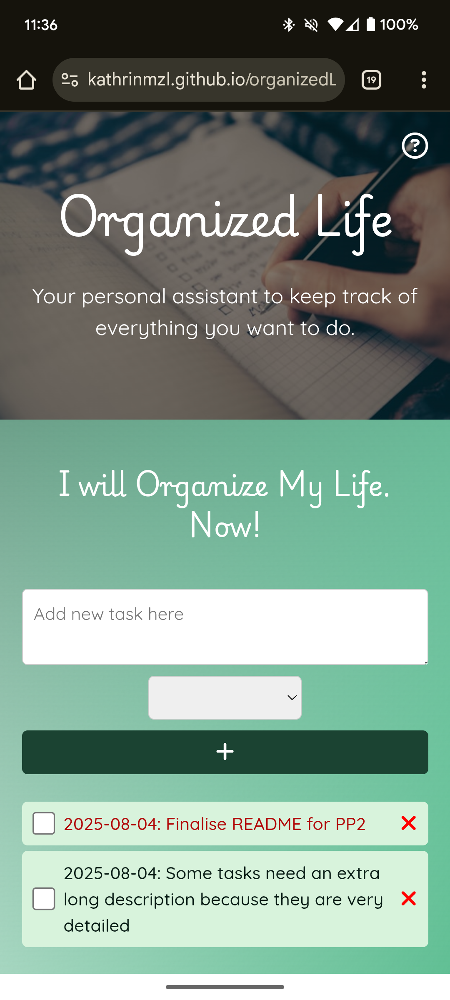

#### Minimum Date not working in Safari browser on iPhones
While testing the website in the Safari browser on an iPhone, my friend discovered that the deadline input field still allows past dates, despite using the `min` attribute. It appears that Safari on iOS does not recognize the `min` and `max` attributes for `input type="date"`.

A google search revealed that this is a known issue (see [Stack Overflow](https://stackoverflow.com/questions/26929297/html-5-input-type-date-control-max-date-is-not-working-in-iphone-ipad)). A commonly suggested workaround is to use a JavaScript date picker library like Pikaday. I plan to address this compatibility issue in a future development stage.

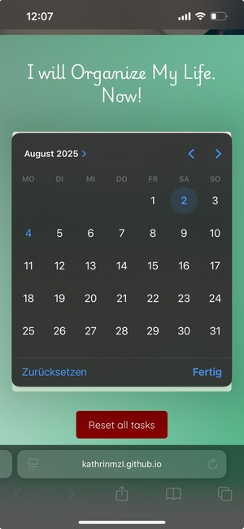

- - -

## Technologies Used

### Languages Used

JavaScript, HTML and CSS were used to create this website

### Frameworks, Libraries & Programs Used

Balsamiq - Used to create wireframes

Git - For version control

Github - To save and store the files for the website

Bootstrap Version 5.3 - Code for the instructions modal was used and modified. Additional CSS styling was also implemented in style.css

Google Fonts - To import the fonts used on the website

Font Awesome - For the iconography on the website

Google Dev Tools - To troubleshoot and test features, solve issues with responsiveness and styling

[Autoprefixer](https://autoprefixer.github.io/) - To autoprefix CSS code

[Favicon.io](https://favicon.io/) - To create favicon

[Am I Responsive?](http://ami.responsivedesign.is/) - To show the website image on a range of devices

[Shields.io](https://shields.io/) - To add badges to the README

- - -

## Deployment & Local Development

### Deployment

Github Pages was used to deploy the live website. The instructions to achieve this are below:

1. Log in (or sign up) to Github.
2. Find the repository for this project, organizedLife.
3. Click on the Settings link.
4. Click on the Pages link in the left hand side navigation bar.
5. In the Source section, choose main from the drop down select branch menu. Select Root from the drop down select folder menu.
6. Click Save. Your live Github Pages site is now deployed at the URL shown.

Link to the deployed website: [https://kathrinmzl.github.io/organizedLife/](https://kathrinmzl.github.io/organizedLife/)

### Local Development

#### How to Fork

To fork the organizedLife repository:

1. Log in (or sign up) to Github.
2. Go to the repository for this project, kathrinmzl/organizedLife.
3. Click the Fork button in the top right corner.

#### How to Clone

To clone the organizedLife repository:

1. Log in (or sign up) to GitHub.
2. Go to the repository for this project, kathrinmzl/organizedLife.
3. Click on the code button, select whether you would like to clone with HTTPS, SSH or GitHub CLI and copy the link shown.
4. Open the terminal in your code editor and change the current working directory to the location you want to use for the cloned directory.
5. Type 'git clone' into the terminal and then paste the link you copied in step 3. Press enter.

- - -

## Credits

### Code Used

- CodePhilip: YouTube Tutorial "Save To Do List in Browser (NO DATABASE NEEDED) | JavaScript Beginner Project"
    - Basic To Do List structure for adding, deleting and saving tasks
    - https://www.youtube.com/watch?v=p6F5TBxs88A
    - I chose this tutorial as a base layout for my project and added other features afterwards

- w3schools
    - Basic code of scroll-to-top functionality
    - https://www.w3schools.com/howto/howto_js_scroll_to_top.asp

### Content

The content for the website was written by myself. Some parts of the Features section in this README were refined with the help of ChatGPT to improve clarity and phrasing.

### Media

The header background image was taken from the [Unsplash](https://unsplash.com/) website.

The to-do list icon that has been used as favicon was created by Graphics Plazza and taken from [flaticon](https://www.flaticon.com/free-icons/to-do-list).

All other icons are taken from [Font Awesome](https://fontawesome.com/icons).

### Version Control
Halfway through the project, I updated my commit style to follow the [Conventional Commits](https://www.conventionalcommits.org/en/v1.0.0/) guideline after receiving feedback on my PP1 project ([Inside India](https://github.com/kathrinmzl/inside-india)) suggesting this approach for clearer and more consistent commit messages.